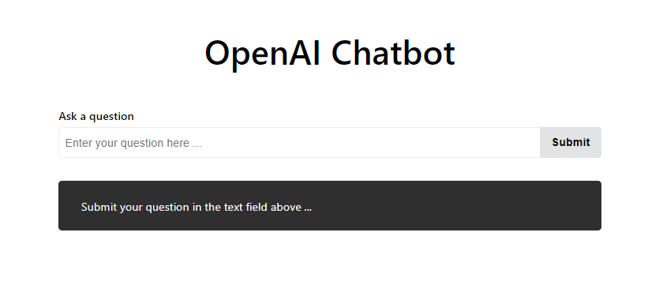

# OpenAI Chatbot in React

A simple chatbot that uses OpenAI's GPT-3 to generate responses to user input. The chatbot is built using React and the server is built using Node.js and Express. The server connects to OpenAI's GPT-3 API to generate responses to user input.

## How To Get Started

In the project directory, you can run:

### `npm install`

To install all the dependencies required to run the app.

### `Add your OpenAI API key`

Change the `API_KEY` variable in `server.js` to your OpenAI API key.

### `npm start`

Runs the app in the development mode.\
Open [http://localhost:3000](http://localhost:3000) to view it in your browser.

The page will reload when you make changes.\
You may also see any lint errors in the console.

### `node server.js`

Runs the server that connects to OpenAI's GPT-3 API.\

## Learn More

To learn more about OpenAI's GPT-3, check out the [OpenAI API documentation](https://beta.openai.com/docs/).
